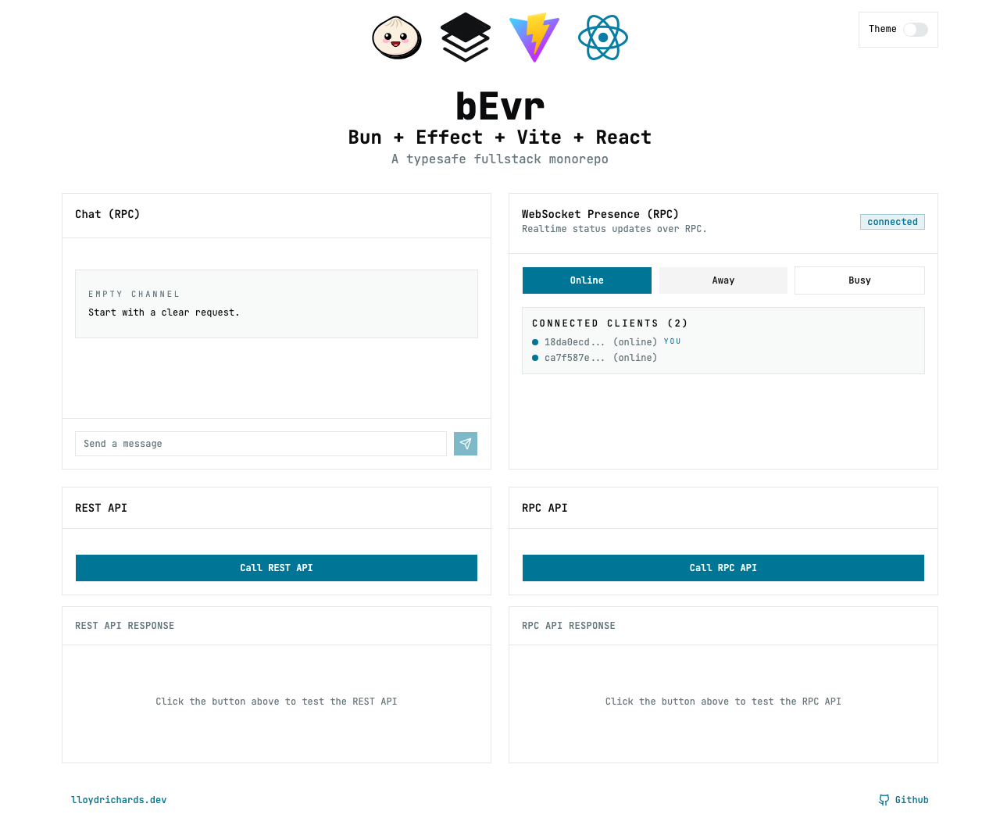

# bEvr Stack

A Bun, Effect 4, Vite, and React template with shared schemas, REST endpoints,
streaming RPC, WebSocket presence, AI chat, and a Model Context Protocol server.



## Start a project

Create a repository from this GitHub template, then clone your new repository.
The template includes Effect 4.

Install Bun 1.4.0 and Node.js 24. The project uses TypeScript 7, Vitest 5,
Vite 8, Tailwind CSS 4, and Biome 2.5. Alternatively, use the Nix development
shell with `direnv allow`, or open the repository in the included Node 24 and
Bun 1.4.0 development container. Check `bun --version` and `node --version` before
installing dependencies.

From the repository root:

```bash
bun install --frozen-lockfile
cp .env.example .env
```

Set `ANTHROPIC_API_KEY` in `.env` to your Anthropic API key, then start the apps:

```bash
bun run dev
```

The API reads the key at startup, even if you only use the REST or presence
demos. Chat uses Anthropic and can incur usage charges. The client and MCP
server can run independently without a key.

| App | Address | Purpose |
| --- | --- | --- |
| `client` | `http://localhost:3000` | React demo |
| `server` | `http://localhost:9000` | Health endpoint |
| `server` | `http://localhost:9000/hello/` | REST greeting |
| `server` | `http://localhost:9000/rpc` | HTTP RPC and chat |
| `server` | `ws://localhost:9000/ws` | Presence RPC |
| `server-mcp` | `http://localhost:9009/mcp` | MCP requests |

To run one app:

```bash
bun run dev --filter=client
bun run dev --filter=server
bun run dev --filter=server-mcp
```

Root `bun run` commands load `.env` and pass the declared variables through
Turborepo. If you run Bun directly inside `apps/server`, put the server settings
in `apps/server/.env` or export them in your shell.

## Check changes

```bash
bun run lint
bun run format:check
bun run type-check
bunx playwright install chromium
bun run test
bun run build
bun run test:e2e -- --reporter=list
```

Use `bun run format` to apply Biome fixes. Use `bun run test`, because `bun test`
starts Bun's own test runner instead of the configured Vitest tasks.

The client tests run in Chromium. Server tests use `@effect/vitest`. The MCP
workspace currently has no unit tests. The end-to-end suite starts the client
and API, then checks REST, streaming RPC, WebSocket status updates, and the
visual baseline. It uses a placeholder AI key and makes no Anthropic requests.

For one workspace or test file:

```bash
bun run test --filter=client
bun run test --filter=server -- src/index.test.ts
```

[`Check - Template`](.github/workflows/check-template.yml) runs formatting,
lint, all workspace types, tests, builds, and Linux end-to-end tests for every
PR to `main` and every push to `main`. The existing client and server workflows
also run their focused checks. Make the template check required in your new
repository's branch protection settings if you want it to block merges.

See [the end-to-end guide](e2e/README.md) for Linux verification and visual
baseline updates.

## Use the workspace packages

| Package | Source | Purpose |
| --- | --- | --- |
| `@repo/domain` | [`packages/domain`](packages/domain/README.md) | Shared schemas and API/RPC definitions |
| `@repo/ai` | [`packages/ai`](packages/ai/README.md) | Anthropic models, chat, and sample tools |
| `@repo/presence` | [`packages/presence`](packages/presence/README.md) | Connected clients and status events |
| `@repo/observability` | [`packages/observability`](packages/observability/README.md) | Runtime logging and OpenTelemetry |
| `@repo/config-typescript` | [`packages/config-typescript/base.json`](packages/config-typescript/base.json) | Shared compiler and Effect diagnostics settings |

Import schemas and types through the domain subpaths, for example
`@repo/domain/Api` or `@repo/domain/WebSocket`.

Effect ecosystem packages are pinned together at `4.0.0`. The HTTP, RPC, AI,
and reactivity APIs use paths such as `effect/http`, `effect/http-api`,
`effect/rpc`, and `effect/reactivity`. Their APIs can still be marked unstable
without an `unstable/` path segment.

`bun install` patches the TypeScript 7 compiler with `@effect/tsgo`. The shared
configuration retains the plugin name `@effect/language-service`, as required
by that integration. The VS Code settings select the patched native compiler
from `node_modules/typescript/bin`. When upgrading TypeScript, check the supported compiler
versions in the [Effect TypeScript integration](https://github.com/Effect-TS/tsgo).

## Run MCP tools

Start `server-mcp`, then connect your MCP client to
`http://localhost:9009/mcp`. This is a POST endpoint, so opening it in a browser
with GET returns `405`.

The sample server exposes a primer resource, a greeting prompt, and a local
`GetDadJoke` tool. It supports the five protocol versions listed in
[`apps/server-mcp/src/index.ts`](apps/server-mcp/src/index.ts). The July 2026
protocol uses stateless requests. Older clients use initialization.

For the interactive MCPJam Inspector, run:

```bash
bun --filter=server-mcp run inspector
```

The inspector script starts the MCP server itself. See
[the MCP guide](apps/server-mcp/README.md) for API examples.

## Run with Docker Compose

Copy `.env.example` to `.env` and set `ANTHROPIC_API_KEY`, then run:

```bash
docker compose up -d --build
```

Compose publishes the client on port 3000, the API on port 9000, the MCP server
on port 9009, and Jaeger on port 16686. It also starts an OpenTelemetry collector.
The API and MCP server export traces to the collector, which forwards them to
Jaeger.

Set `CLIENT_PORT`, `SERVER_PORT`, and `MCP_PORT` to change the host ports.
If you change the API port or hostname, also update `VITE_SERVER_URL` and
`VITE_WS_URL`. Set `ALLOWED_ORIGINS` to the browser client's origin.

Vite embeds the browser URLs during the build. Rebuild the client image after
changing them. Use a hostname reachable from the browser, rather than a
Compose service name. For a remote deployment, configure public HTTPS and WSS
URLs and the matching CORS origin.

To stop the services:

```bash
docker compose down
```

## Configuration reference

[`.env.example`](.env.example) lists the setup values. Defaults live in the
server entry points and client atoms.

| Variable | Used by | Default or requirement |
| --- | --- | --- |
| `ANTHROPIC_API_KEY` | API server | Required at startup |
| `PORT`, `HOST` | API server | `9000`, `0.0.0.0` |
| `IDLE_TIMEOUT` | API server | `120` seconds |
| `MCP_PORT` | MCP server and Compose host mapping | `9009` |
| `ALLOWED_ORIGINS` | API server | `http://localhost:3000`, comma-separated |
| `VITE_SERVER_URL` | Client build and dev | `http://localhost:9000` |
| `VITE_WS_URL` | Client build and dev | `ws://localhost:9000/ws` |
| `DEVTOOLS`, `VITE_ENABLE_DEVTOOLS` | Servers, client | `false` |
| `LOG_LEVEL` | Servers | `Info` |
| `OTEL_EXPORTER_OTLP_ENDPOINT`, `OTEL_SERVICE_NAME` | Servers | Set both to enable tracing |
| `CLIENT_PORT`, `SERVER_PORT` | Compose host mappings | `3000`, `9000` |

## App guides

- [Client](apps/client/README.md)
- [API server](apps/server/README.md)
- [MCP server](apps/server-mcp/README.md)
- [Effect 4 source and migration guide](https://github.com/Effect-TS/effect)
